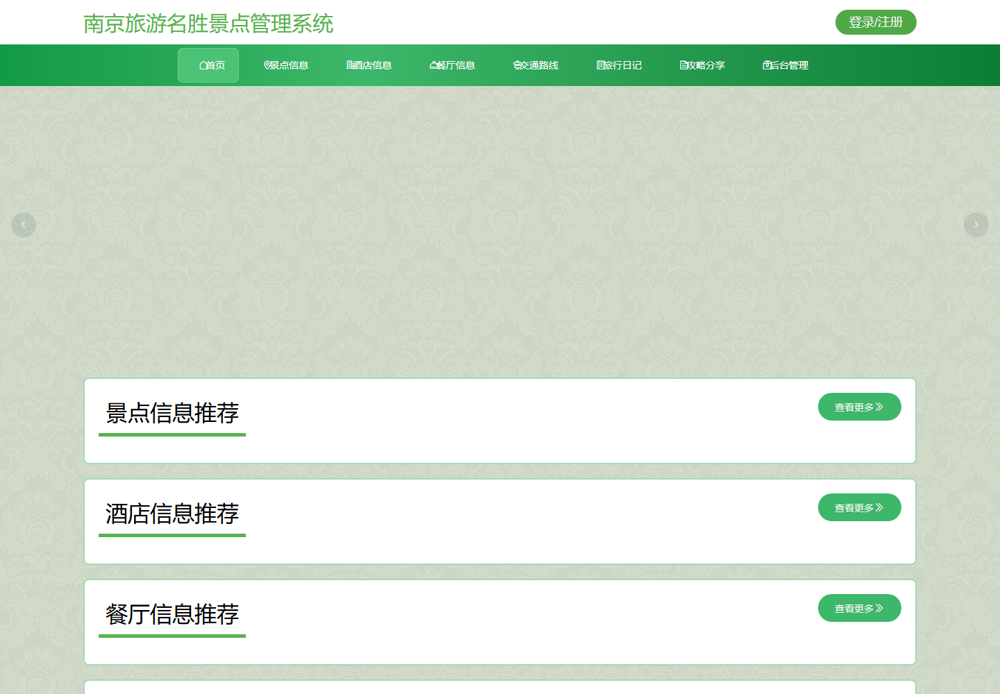
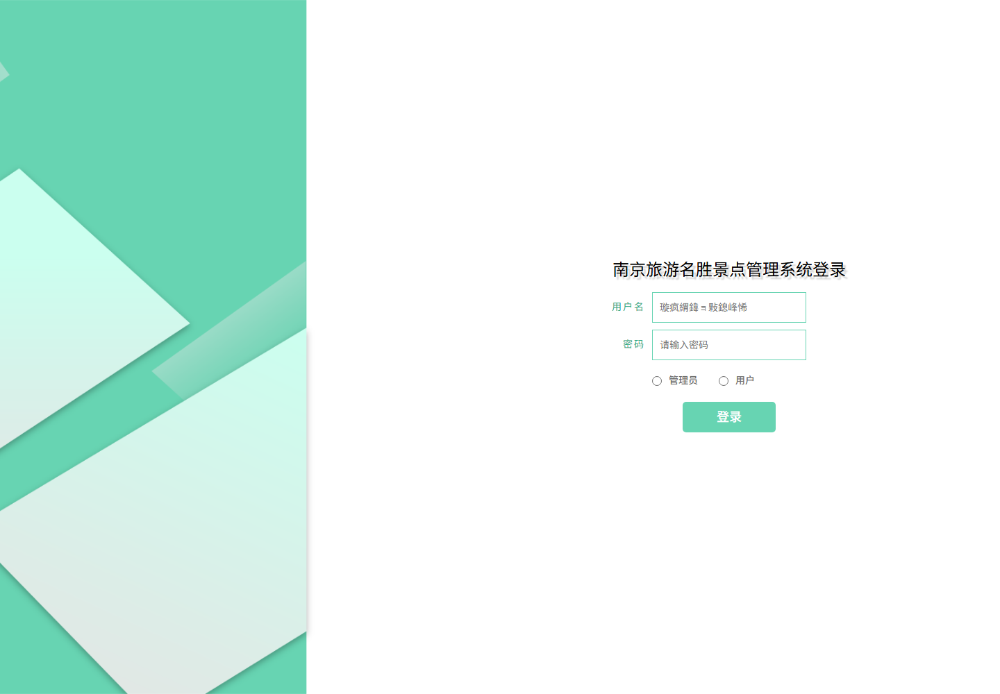

# ot-nanjing

南京旅游服务平台，提供景点、酒店、餐厅、交通路线、旅行日记和预订管理的一体化演示系统。

[](https://ot-nanjing.pages.dev)
[](LICENSE)
[](https://ot-nanjing.pages.dev)
[](docs/deployment.md)
[](docs/deployment.md)

## 在线演示

| 项目 | 地址 |
|---|---|
| GitHub 仓库 | https://github.com/Nemo-netone/ot-nanjing |
| 游客端演示 | https://ot-nanjing.pages.dev |
| 后台端演示 | https://ot-nanjing.pages.dev/admin/ |
| 生产分支 | `main` |
| Cloudflare Pages 项目 | `ot-nanjing` |
| CloudBase Run 服务 | `ot-nanjing-api` |
| Supabase schema | `ot_nanjing` |

> 当前 Cloudflare Pages 静态页面已发布并可访问。CloudBase Run 服务对象已创建，但服务详情接口返回资源隔离提示，后端 API 暂未完成线上验证；完整登录、预订、后台增删改查功能需要 CloudBase 资源恢复后继续验证。

## 演示账号

| 入口 | 账号 | 密码 | 角色 |
|---|---|---|---|
| `/admin/` | `admin` | `admin` | 管理员 |
| `/` | `账号1` | `123456` | 用户 |
| `/` | `111` | `111` | 用户 |

这些账号来自 `supabase/migrations/202607090001_init_ot_nanjing.sql` 的演示种子数据。请不要在演示环境录入真实手机号、地址、支付信息或其他敏感信息。

## 截图






## 功能概览

- 游客端：首页推荐、景点信息、酒店信息、餐厅信息、交通路线、旅行日记、攻略分享。
- 用户能力：注册登录、个人中心、收藏、评论、旅行日记发布、景点门票预订、酒店预订、餐厅预订。
- 管理端：用户管理、景点管理、酒店管理、餐厅管理、交通路线管理、订单/预订管理、内容审核与基础配置。
- 数据层：Supabase PostgreSQL 独立 schema `ot_nanjing`，避免和其他项目数据混用。
- 部署层：Cloudflare Pages 承载游客端和后台端静态资源，CloudBase Run 承载 Spring Boot API。

更完整的功能树和使用场景见 [docs/features.md](docs/features.md)，演示账号说明见 [docs/accounts.md](docs/accounts.md)，部署记录见 [docs/deployment.md](docs/deployment.md)。

## 技术栈

| 层级 | 技术 |
|---|---|
| 游客端 | Vue 2, Vue Router, Vuex, Element UI |
| 后台端 | Vue 2, Element UI, Axios, ECharts |
| 后端 | Spring Boot 2.2, Java 8, MyBatis Plus, Shiro |
| 数据库 | Supabase PostgreSQL，兼容原 MySQL 初始化脚本 |
| 部署 | Cloudflare Pages, CloudBase Run, Docker |

## 本地运行

后端：

```powershell
$env:DB_DRIVER_CLASS_NAME="org.postgresql.Driver"
$env:DB_URL="jdbc:postgresql://<supabase-host>:5432/postgres?sslmode=require&currentSchema=ot_nanjing"
$env:DB_USERNAME="<project-runtime-db-role>"
$env:DB_PASSWORD="<database-password>"
$env:APP_CONTEXT_PATH="/springboot655ms"
mvn spring-boot:run
```

游客端：

```powershell
Set-Location src/main/resources/front/front
npm install --legacy-peer-deps
npm run serve
```

后台端：

```powershell
Set-Location src/main/resources/admin/admin
npm install --legacy-peer-deps
npm run serve
```

生产构建：

```powershell
Set-Location src/main/resources/front/front
npm run build

Set-Location ../../admin/admin
npm run build

Set-Location ../../../../../
mvn -B -DskipTests clean package
```

## 部署说明

Cloudflare Pages 生产分支固定为 `main`，稳定演示地址固定为 `https://ot-nanjing.pages.dev`。后续重新发布应继续使用同一个 Pages 项目和同一分支，避免演示地址变化。

后端 CloudBase Run 目标服务为 `ot-nanjing-api`，公开 API base 规划为：

```text
https://ot-nanjing-api-273280-7-1369167244.sh.run.tcloudbase.com/springboot655ms
```

当前已知限制：

- CloudBase Run 服务详情返回 `ResourceUnavailable.ResourceIsolated`，提示资源包过期或配额不足。
- 因后端暂未线上可用，登录、数据库列表、预订和后台接口无法在生产演示站完整验证。
- 前端静态页面、截图和 Supabase schema 已完成验证。

## 许可协议

本项目使用 PolyForm Noncommercial License 1.0.0。允许非商业用途的学习、修改和展示；商业使用需要获得作者单独授权。
